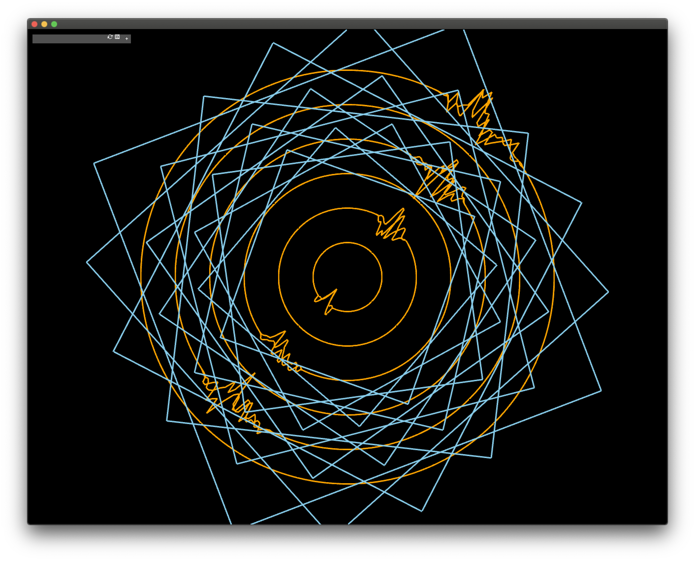
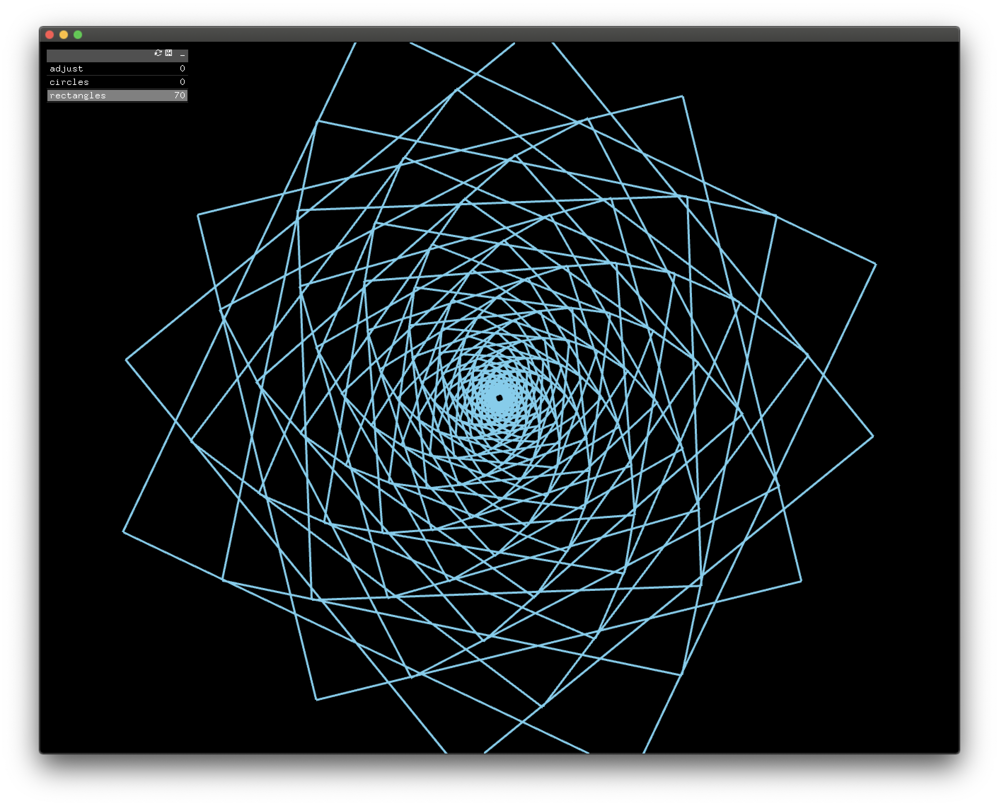
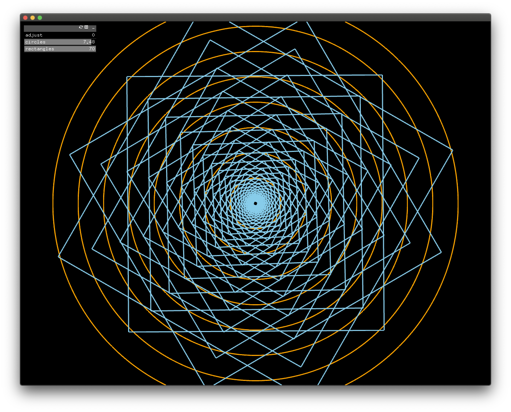

# Motion

## Recording
https://youtu.be/74xpz3emLGs

## Initial Idea
For this assignment, I decided to continue working on my previous sketch (Mandala-Inspired sketch.) My main intention for this assignment was to see how I could try and manipulate the shapes on the screen to give them more character/life. The idea was to explore purely geometric shapes and how the feeling can be changed through adding slight modulations - for example, on the circles, using noise to enhance the shapes. 

## Process
I was inspired by one of the examples from the Book of Shaders chapter (https://thebookofshaders.com/11/) and started looking for previous projects which presented similar visuals online. I found a great sketch by junkiyoshi (https://github.com/junkiyoshi/Insta20200715) and took inspiration from his work to integrate in to my own 'mandala' piece. 

## Gallery 

![motion2](motion_assignment/bin/data/motion_2.png 

