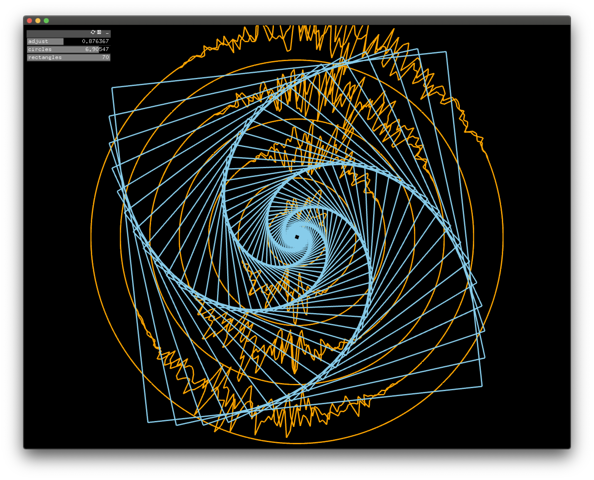

# Motion

## Initial Idea
For this assignment, I decided to continue working on my previous sketch (Mandala-Inspired sketch.) My main intention for this assignment was to see how I could try and manipulate the shapes on the screen to give them more character/life. The idea was to explore purely geometric shapes and how the feeling can be changed through adding slight modulations - for example, on the circles, using noise to enhance the shapes. 

## Recording
https://youtu.be/74xpz3emLGs 

## Process
I was inspired by one of the examples from the Book of Shaders chapter (https://thebookofshaders.com/11/) and started looking for previous projects which presented similar visuals online. I found a great sketch by junkiyoshi (https://github.com/junkiyoshi/Insta20200715) and took inspiration from his work to integrate in to my own 'mandala' piece. 

I started off with my previous sketch and started to make some modifications. The first thing I did was remove the circles that were drawn previously and replaced them with the ofVertex shape. Although I should be more familiar with the code, I was a little unsure about what each part did, but I started to change things around and slowly understand what parts did what. After doing so, I added the GUIs in order to actually change the shapes to my liking. 
 
 
--> ofVertex(location + gap * ofMap(distance, 0, radius * **floatSlider1**, 1, 0));
 
 
//the floatSlider value changes the radius value (if increased, it maniuplates the whole circle instead of a part of it) the values were between 0 and 2. 
 
 
After this, I added the GUI to change the amount of circles appearing on the screen, as well as the rectangles. I chose to stick with the same color scheme as before, as I kinda enjoyed the blue/orange and the fade. 

## Outcome
I think the noise added a lot to what i previously had and actually manipulating the shapes a little was satisfying to see, however I am not 100% satisfied with the outcome. I love the idea of geometric vs organic shapes and I want to try to work towards making a visual which illustrates this. I don't think this particular assignment does exactly that yet, but I would like to further explore it in future work. For example, the "organic" shapes didn't come across as well as it could have (it still seemed geometric) I also should've played around with it more (eg. instead of using ofRandom, try to create a more steady pattern.) I also would love to play around more with the colors - I stuck with the previous color scheme, but it would be cool to change them around as well. 

## Gallery 

  
  
  
  

